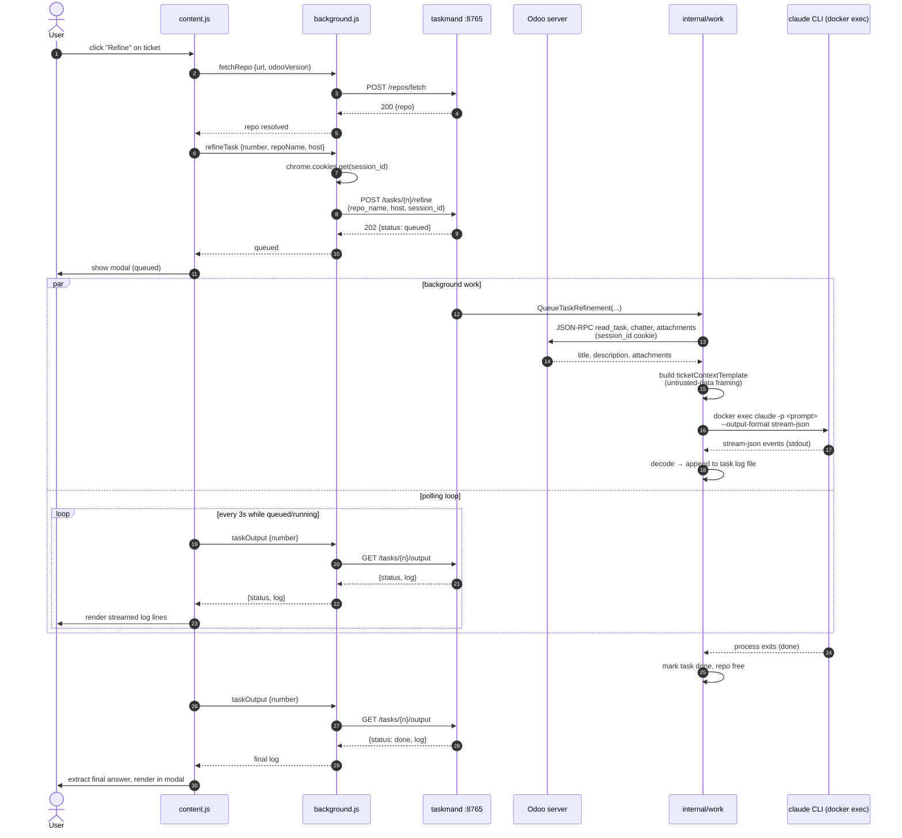

# Browser → Backend → Agent data flow

How a click on an Odoo ticket page turns into a Claude Code run inside the
project's dev container, and how the result finds its way back to the
screen. See [docs/PLAN.md](PLAN.md) for the broader architecture rationale.

## Sequence — Refine (Implement is identical)

## What crosses each boundary

**01 — Page → content script.** No network call. `scrape.js` reads the DOM
once an Odoo `project.task` form is detected, pulling only
`{taskNumber, projectName}` — never the ticket title or description, which
stay server-side.

**02 — content.js → background.js.** Everything crosses as a typed
`chrome.runtime.sendMessage`. `background.js` is the only script allowed to
reach the daemon or read Odoo's HttpOnly `session_id` cookie via the
`cookies` permission.

**03 — background.js → taskmand.** Plain HTTP to `127.0.0.1:8765`.
`POST /tasks/{number}/refine` carries only `{repo_name, host, session_id}` —
the daemon fetches ticket content itself rather than trusting what the page
rendered.

**04 — internal/work → Odoo, then the agent.** The daemon calls Odoo's
JSON-RPC `call_kw` directly with the forwarded session cookie, wraps the
result in an explicit "untrusted data" prompt template, then runs
`docker exec … claude -p <prompt> --output-format stream-json` inside the
repo's own dev container — the agent has real codebase access, not a copy.

**05 — Streaming back.** No SSE or websocket: stream-json events are decoded
and flushed to a log file on disk. The extension recovers progress purely by
polling `GET /tasks/{number}/output` every 3 seconds until status leaves
`queued`/`running`.

## Source

- [`extension/src/content.js`](../extension/src/content.js) /
  [`scrape.js`](../extension/src/scrape.js) — DOM detection, no ticket
  content scraped
- [`extension/src/background.js`](../extension/src/background.js) — the
  only script touching the daemon or the Odoo session cookie
- [`internal/api/api.go`](../internal/api/api.go) — the
  `POST /tasks/{n}/refine` + `GET /tasks/{n}/output` polling endpoints
- [`internal/work/work.go`](../internal/work/work.go) — fetches ticket
  content from Odoo server-side, then runs
  `docker exec … claude -p ... --output-format stream-json` in the repo's
  own container
- [`internal/odoo/`](../internal/odoo/) — direct JSON-RPC calls from the
  backend, not the browser
